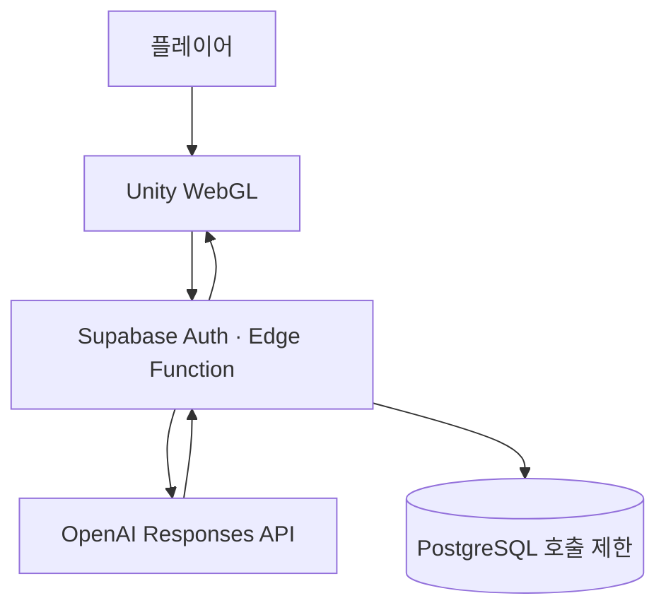

# Detective A&I

> 플레이어가 직접 수집하고 해석한 증거를 바탕으로, AI 형사가 사건을 재구성하는 2D 추리 어드벤처

[게임 플레이](https://1seong.github.io/DetectiveAI/) · [게임 소개 문서](https://docs.google.com/document/d/15dc0hLqwKs7oqSOt1NUf-LCGrmEeYrv-Elw1sJkeeG4/edit?tab=t.0#heading=h.glg28mro9zew)

## 프로젝트 개요

| 항목 | 내용 |
| --- | --- |
| 장르 | 2D 포인트 앤 클릭 추리 어드벤처 |
| 플랫폼 | WebGL |
| 권장 환경 | PC Chrome / Edge |
| 예상 플레이 시간 | 15~30분 |
| 엔진 | Unity 6000.4.3f1 |
| AI 모델 | OpenAI `gpt-5.4-mini` |
| 서버 | Supabase Auth · Edge Functions · PostgreSQL |
| 배포 | GitHub Pages |

**Detective A&I**는 빵집 마을에서 벌어진 사건을 조사하는 추리 게임입니다. 플레이어는 현장을 탐색하며 수상한 장면을 직접 촬영하고, 사진이 무엇을 의미한다고 생각하는지 자연어로 기록합니다. AI 형사는 정답을 대신 찾는 도구가 아니라, 플레이어가 선택한 증거와 해석을 바탕으로 하나의 최종 추리를 구성하는 파트너입니다.

정해진 선택지를 조합하는 방식과 달리, 같은 증거도 플레이어의 해석에 따라 전혀 다른 추리로 이어질 수 있습니다. 게임은 이 자유로운 입력을 검증하고, 서사로 연결하고, 정답과 비교해 평가하는 과정에 AI를 사용합니다.

## 핵심 플레이

1. 사건 현장과 인물을 조사합니다.
2. 중요하다고 판단한 화면 영역을 사진으로 촬영합니다.
3. 여러 증거를 선택하고 자신의 해석을 작성해 형사에게 전달합니다.
4. 입력 검증 AI가 증거와 설명의 관련성을 확인합니다.
5. 수집한 기록을 바탕으로 형사 AI가 최종 추리를 발표합니다.
6. 평가 AI가 추리의 정확도와 잘못 채택된 함정 주장을 판정합니다.

### 핵심 차별점

- **선택지가 아닌 해석을 수집합니다.** 플레이어는 증거의 의미를 직접 서술합니다.
- **같은 사건에서 서로 다른 추리가 만들어집니다.** AI 형사는 플레이어가 제공한 정보에 강하게 의존합니다.
- **오답도 플레이의 일부입니다.** 사건과 관련된 주장이라면 틀린 해석도 수용되며, 최종 결과에서 그 영향이 드러납니다.
- **AI를 게임 규칙 안에 제한합니다.** 각 단계의 입력·출력과 사용 가능한 정보가 명확히 구분됩니다.

## AI 시스템

게임은 하나의 범용 챗봇 대신 역할이 분리된 세 개의 AI 단계를 사용합니다.

| 단계 | 역할 | 입력 | 출력 | 주요 설정 |
| --- | --- | --- | --- | --- |
| 입력 검증 AI | 플레이어의 설명이 선택한 증거 또는 사건과 의미상 연결되는지 판정 | 증거 데이터, 플레이어 설명 | `Accept` / `RequestClarification`, 캐릭터 응답 | reasoning `none`, 최대 300 tokens |
| 형사 추리 AI | 플레이어가 전달한 기록만으로 최종 추리를 구성 | 배경 사실, 증거 목록, 플레이어 설명 | 추리 대사와 범인·동기·장소·시간·접근 방식 등 9개 구조화 항목 | reasoning `low`, 최대 1,500 tokens |
| 결과 평가 AI | 최종 추리를 정답 데이터와 항목별로 비교하고 함정 주장 채택 여부를 탐지 | 최종 추리, 사건 정답 | 9개 항목별 0~1 점수, 탐지된 함정 주장 ID | reasoning `low`, 최대 1,000 tokens |

세 단계 모두 `gpt-5.4-mini`와 OpenAI Responses API를 사용합니다. 응답은 **Strict JSON Schema**로 제한해 Unity가 안정적으로 역직렬화할 수 있도록 했으며, `store: false`를 적용했습니다.

### 설계 원칙

- 입력 검증은 주장의 정답 여부가 아니라 **증거와의 관련성**을 판단합니다.
- 형사 AI는 플레이어가 설명하지 않은 증거 요소를 자의적으로 사용하지 않습니다.
- 추리 결과는 서사뿐 아니라 범인, 동기, 장소, 시간, 접근 방식, 핵심 행동 등으로 구조화합니다.
- 평가 AI는 각 항목을 독립적으로 채점하고, 플레이어의 최종 추리에 실제로 사용된 함정 주장만 탐지합니다.

## 시스템 구조



1. Unity 클라이언트가 별도의 로그인 화면 없이 Supabase 익명 세션을 발급받습니다.
2. 플레이어 입력과 AI 작업 유형을 JWT와 함께 Edge Function으로 전송합니다.
3. 서버가 인증, 입력 형식, 요청 크기, 호출 한도를 확인합니다.
4. 서버에 고정된 모델·프롬프트·토큰 설정으로 OpenAI API를 호출합니다.
5. 구조화된 JSON 응답을 Unity가 게임 대사, 추리 결과, 점수에 반영합니다.

## 보안 및 비용 제어

- OpenAI API 키와 시스템 프롬프트는 **Supabase Edge Function Secret**으로만 관리하며 WebGL 빌드에 포함하지 않습니다.
- 클라이언트에는 공개 가능한 Supabase publishable key만 사용하고, AI 호출에는 유효한 익명 사용자 JWT를 요구합니다.
- Edge Function의 JWT 검증을 활성화하고 Supabase Auth를 통해 사용자 정보를 다시 확인합니다.
- 사용자별 호출량을 **분당 40회, 일일 600회**로 제한합니다.
- 요청 본문은 64 KiB로 제한하고, 서버에서 허용한 작업·모델·출력 토큰만 사용할 수 있습니다.
- OpenAI 응답 제한 시간과 프로젝트 월간 비용 한도를 함께 적용해 비정상 요청에 따른 비용 위험을 줄였습니다.

## 기술 스택

| 영역 | 기술 |
| --- | --- |
| Client | Unity, C#, URP 2D, uGUI, UniTask, Newtonsoft.Json |
| AI | OpenAI Responses API, Structured Outputs |
| Backend | Supabase Edge Functions (TypeScript/Deno), Auth, PostgreSQL RPC |
| Web | Unity WebGL, WebGLInput |
| Deployment | GitHub Pages |

## 저장소 구성

```text
Assets/
├─ Scripts/
│  ├─ AI/          # AI 요청, 익명 인증, 응답 데이터 구조
│  ├─ Evidence/    # 증거 수집과 사진 시스템
│  └─ UI/          # 대화, 수첩, 인벤토리, 결과 화면
├─ Scenes/         # 메인 메뉴, 오프닝, 인게임 씬
└─ Data/           # 사건·증거·평가 데이터
Packages/          # Unity 패키지 의존성
ProjectSettings/   # Unity 프로젝트 설정
```

- `main`: Unity 프로젝트 소스
- `gh-pages`: 심사용 WebGL 빌드

## 실행 안내

심사 시에는 상단의 **게임 플레이** 링크를 이용하는 것을 권장합니다. 최초 실행에는 WebGL 리소스 로딩 시간이 필요하며, AI 기능은 네트워크 연결이 필요합니다.

로컬에서 확인하려면 Unity **6000.4.3f1**로 저장소를 열어 실행할 수 있습니다. AI 기능은 Supabase 프로젝트 URL과 publishable key 설정이 필요합니다.

## 문서 및 크레딧

AI별 프롬프트 설계, 세부 입출력 정의, 서버 보안 구성과 AI 아트 활용 내역은 [AI 활용 기술 문서](https://docs.google.com/document/d/1Es3w_wpFFjzdGcQGdQFS40BmH6o13MXi41UEUGg2I3s/edit?tab=t.0)에서 확인할 수 있습니다. 외부 에셋과 오픈소스 출처는 기술 문서 및 게임 내 Credits에 기재했습니다.
